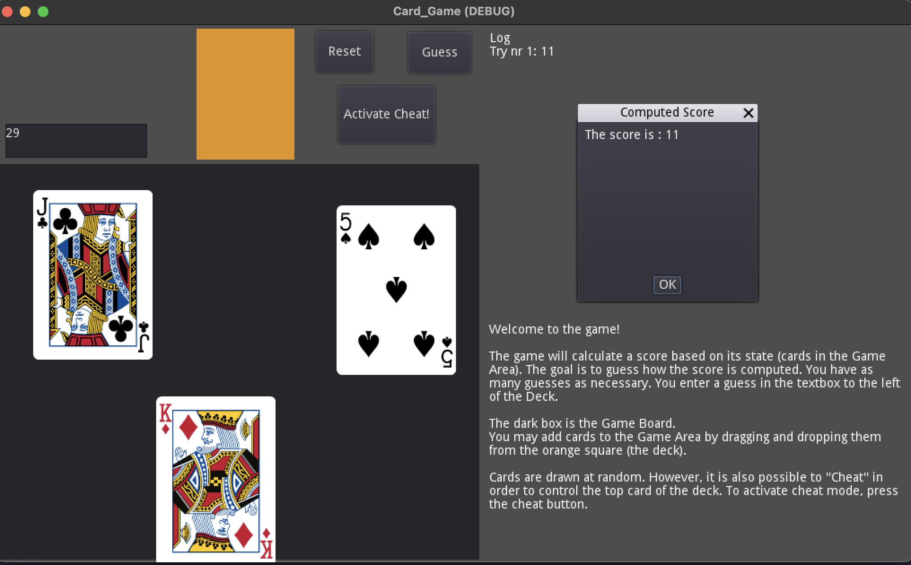
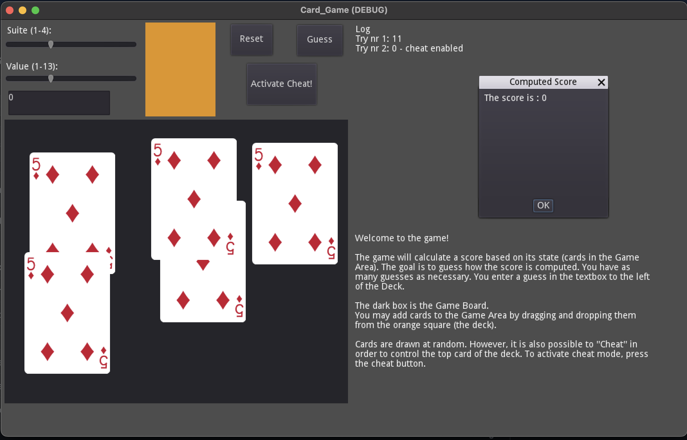

# Score Guessing Game
This software simulates a score guessing game. 

The system will compute a score based on its state, and the goal of the user is to figure out how the score is computed.

## How to Play
The user drags and drops objects into the game area. Once they are satisfied, they may enter a guess, which is then checked by pressing the "Guess" button. The system will then compute the guess and present the result. The user may continue this process as long as they wish.

The system shows a basic log of scores that were previously computed.

## Interactables
The current version supports interactions with a standard 52-card deck. More objects are planned to be added.

Common among the interactables is that they come with some randomness built in. As part of the game, this may be overridden by going into "cheating mode", where the user may for instance select directly which card shall be drawn from the deck.

# Development and Installation
Currently the game is developed using the Godot game engine.

To run the game, open the `project.godot` file in Godot, then run the project.